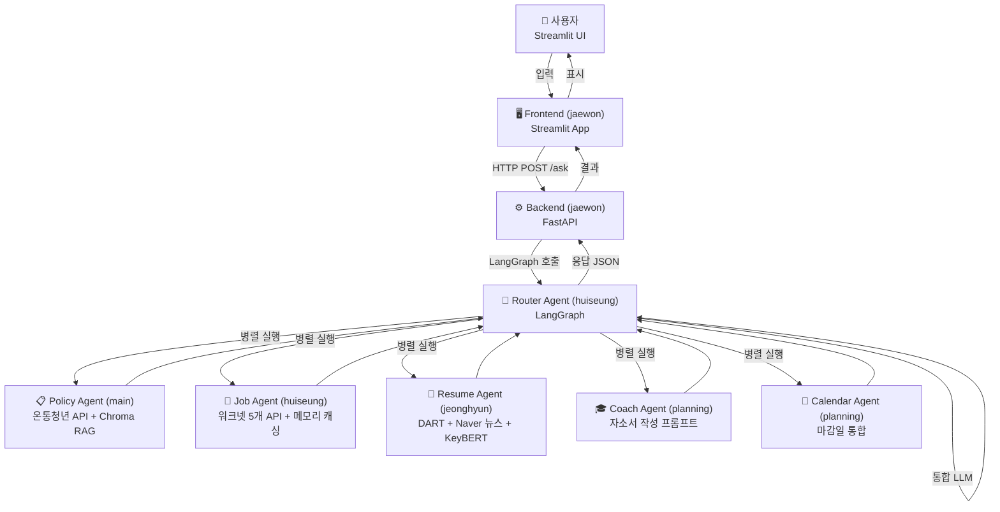
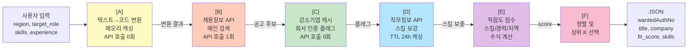
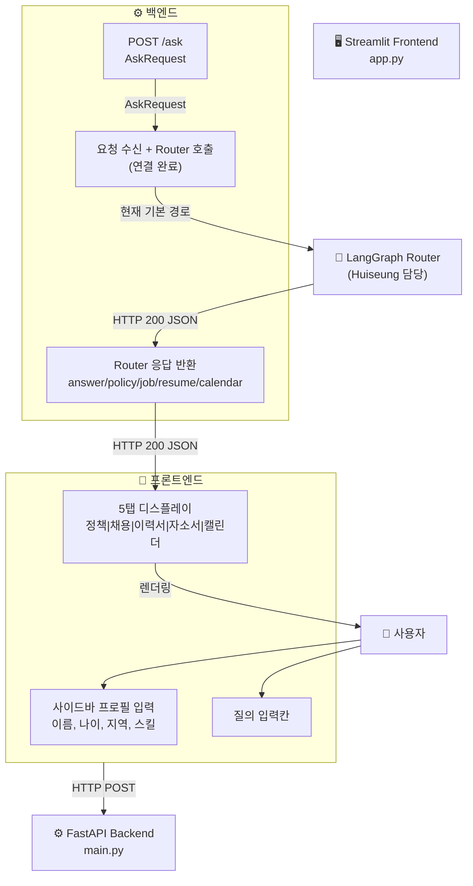
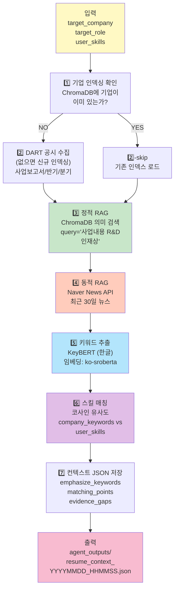
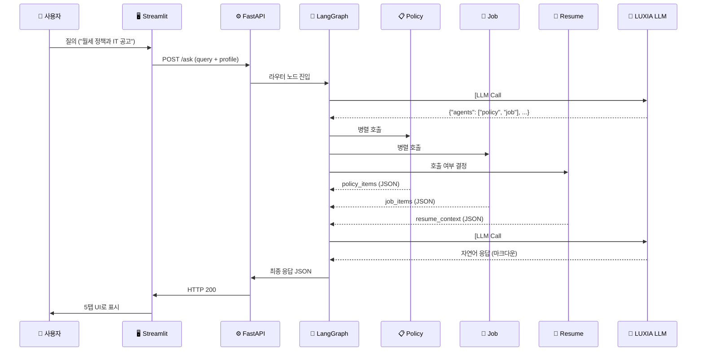

# YouthPath: 통합 아키텍처 & 멀티 에이전트 시스템 완벽 이해

이 문서는 YouthPath 프로젝트의 **4가지 구현 방향 (Main A + 3인 분담)** 을 종합 정리합니다.

---

## 목차
1. [시스템 개요](#시스템-개요)
2. [Main (A 폴더): Policy + RAG 시스템](#main-a-폴더-policy--rag-시스템)
3. [Team Huiseung: Job Agent (워크넷)](#team-huiseung-job-agent-워크넷)
4. [Team Jaewon: Full Stack (Streamlit + FastAPI)](#team-jaewon-full-stack-streamlit--fastapi)
5. [Team Jeonghyun: Resume Agent (DART + Naver)](#team-jeonghyun-resume-agent-dart--naver)
6. [통합 시스템: LangGraph Router](#통합-시스템-langgraph-router)
7. [데이터 흐름 & I/O 명세](#데이터-흐름--io-명세)

---

## 시스템 개요

**최종 목표**: 사용자 1번 질의 → `[정책|채용|이력서]` 3가지를 자동 통합 응답

**현재 상태 (2026-06-01 기준)**: Router 독립 패키지 생성 및 FastAPI `/ask` 연동 완료. LUXIA는 API 계약 전이라 기본 mock provider를 쓰지만, `.env`의 `YOUTHPATH_LLM_PROVIDER=luxia`, `LUXIA_API_URL`, `LUXIA_API_KEY`만 채우면 실제 Provider로 자동 전환되도록 준비 완료. Job/Resume은 실 파이프라인 우선 시도 + 안정 폴백 구조로 Router 연결 완료. 정책 분기 포함 `/ask` E2E 검증 완료.

### 진행 현황 스냅샷 (2026-06-01)

| 영역 | 상태 | 현재까지 완료 | 남은 작업 |
|---|---|---|---|
| Main (A) Policy + RAG | 🟢 연동완료 | 정책 수집/인덱싱/RAG/서비스 로직 운영, Router Policy 호출, 로컬 JSON 폴백, 정책 분기 E2E 검증 | 운영 환경 API/RAG 의존성 정리 |
| Huiseung Job Agent | 🟡 부분완료 | Router 서비스가 Worknet 실 API를 우선 시도하고 실패 시 샘플 데이터 폴백 | Work24 실제 엔드포인트/필드 계약 최종 확인 |
| Jeonghyun Resume Agent | 🟡 부분완료 | Router 서비스가 DART+Naver 비동기 파이프라인을 동적 로드하고 실패 시 컨텍스트 폴백 | `OpenDartReader` 등 의존성 설치 및 API 키 기반 실실행 검증 |
| Jaewon FastAPI/Streamlit | 🟢 완료(연동) | FastAPI `/ask`에서 Router 호출, Streamlit POST payload 연결 | 실제 운영 시나리오 기준 UI/응답 표현 고도화 |
| LangGraph-style Router | 🟢 기반 완료 | `Router/` 패키지 신설, 분류→에이전트→통합 응답 흐름 구현, LUXIA Provider 어댑터 준비, 에이전트 실패 격리, 캘린더 마감 병합 | LUXIA 실제 endpoint/key 수령 후 `.env` 값 입력 |

### 최근 검증 결과 (2026-06-01)

- ✅ Router import smoke test 성공
- ✅ FastAPI 모듈 import 및 앱 타이틀 확인 성공
- ✅ 파일 기반 E2E 검증 스크립트(`tmp_verify_e2e.py`) 실행 성공
  - 검증된 응답 키: `answer`, `policy`, `job`, `resume`, `calendar`, `metadata`, `error`
  - 안정 검증 경로 1: 강제 분류(`job`,`resume`) 기반
  - 안정 검증 경로 2: 강제 분류(`policy`,`job`,`resume`,`calendar`) 기반
  - 정책 포함 결과 예: `policy=7`, `job=2`, `resume=1`, `calendar=6`
- ✅ 루트 `README.md`에 실행법/검증법/LUXIA 전환법 작성 완료
- ⚠️ Resume 실 파이프라인은 현재 환경에서 `OpenDartReader` 미설치 시 폴백으로 동작

**시스템 아키텍처 100ft 뷰**:



---

## Main (A 폴더): Policy + RAG 시스템

## 전체 데이터/제어 흐름 (개념적)

```mermaid
flowchart TD
  A[수집: collect_policies.py]
  B[API 클라이언트: clients/ontong_api.py]
  C[생성된 JSON: data/policies/*.json]
  D[HTML 추출: enrich_policies_html.py]
  E[문서화·청크화: index_policies.py]
  F[RAG/core: core/rag.py<br/>임베딩/Chroma]
  G[서비스: policy_service.py<br/>build_policy_response]
  A -->|fetch_policies()| B
  B --> C
  A --> C
  C -->|targets| D
  D -->|txt outputs| H["data/policies_html"]
  C -->|build_documents| E
  E -->|index_documents| F
  F -->|persist| I["chroma_data/"]
  G -->|search + score| F
  G -->|may call| B
  style A fill:#e1f5ff
  style B fill:#b3e5fc
  style C fill:#81d4fa
  style D fill:#4fc3f7
  style E fill:#29b6f6
  style F fill:#03a9f4
  style G fill:#039be5
```

### 단계별 프로세스

#### 1️⃣ 수집 (`scripts/collect_policies.py`)
- **입력**: 온통청년 API 키 + 검색 쿼리
- **처리**:
  1. `fetch_policies(query)` 호출 (공식/레거시/포털 API 순차 시도)
  2. 결과 정규화 (`normalize_policy()`)
  3. JSON 저장 (`save_policy_json()`)
- **출력**: `data/policies/{policy_id}.json` (1건당 1파일)
- **실행**: `python scripts/collect_policies.py --max-items 200`

#### 2️⃣ HTML 추출 (선택) (`scripts/enrich_policies_html.py`)
- **입력**: `data/policies/*.json` 에서 링크 추출
- **처리**:
  1. 정책별 URL 방문 (httpx + trafilatura)
  2. 본문 텍스트 추출
  3. 도메인별 폴랙은 1.5초 sleep (정중 크롤링)
  4. Circuit Breaker: 연속 5회 실패 시 60초 차단
- **출력**: `data/policies_html/{policy_id}.txt`
- **실행**: `python scripts/enrich_policies_html.py --sample 50`

#### 3️⃣ 문서화 & 청크화 (`scripts/index_policies.py`)
- **입력**: `data/policies/*.json`
- **처리**:
  1. `_policy_text()`: JSON → 정제 텍스트 (필드 병합)
  2. `_chunk_text()`: 민 1000자, 오버랩 100자로 분할
  3. `Document(page_content, metadata)` 생성
  4. Metadata: policy_id, title, region, min_age, max_age, deadline, category, source_url
- **출력**: LangChain `Document` 리스트 (정책당 수개 청크)
- **실행**: `python scripts/index_policies.py --collection policies`

#### 4️⃣ 임베딩 & 벡터 DB (`core/rag.py`)
- **입력**: Document 리스트
- **처리**:
  1. 모델 로드: `HuggingFaceEmbeddings("BAAI/bge-m3")`
  2. 텍스트 → 벡터 (1024차원)
  3. Chroma에 저장 (persistent, `./chroma_data`)
- **출력**: Chroma 컬렉션 (메타데이터 필드 인덱싱)
- **API**: `get_embedding_model()`, `get_collection(name)`, `search(query, k)`

#### 5️⃣ 서비스 & 매칭 (`services/policy_service.py` → `build_policy_response()`)
- **입력**: `profile={age, region, income_bracket}`, `query`
- **처리** (2단계):
  1. **데이터 수집** (병렬):
     - API: `fetch_policies(query)` → 후보 10개
     - RAG: `search("policies", query, k=10)` → 청크 10개
  2. **스코링 & 필터링**:
     - 나이 매칭 (가중치 0.4)
     - 지역 매칭 (가중치 0.3)
     - 소득 매칭 (가중치 0.3)
     - 최소 점수 0.6 미만 제외
     - 내림차순 정렬
- **출력**: 정책 JSON 리스트 (matched/unmatched_criteria, score, link)

---

## Team Huiseung: Job Agent (워크넷)

### 다이어그램: Job Agent의 5개 워크넷 API 역할 분리



### 5개 API 인벤토리

| # | API | 역할 | 호출 빈도 | 캐싱 |
|---|---|---|---|---|
| 1 | **채용정보** | 공고 검색 (메인) | 매 질의 | ❌ |
| 2 | **공통코드** | 지역/경력/학력 코드 | 부팅 시 1회 | ✅ 영구 |
| 3 | **직업정보** | 직무명 ↔ 코드 매칭 | 부팅 시 1회 | ✅ 영구 |
| 4 | **직무정보** | 필수/우대 스킬 | 매 질의 (배치) | ✅ 24h TTL |
| 5 | **강소기업** | 정부 인증 여부 | 주 1회 갱신 | ✅ 메모리 |

### 핵심 로직: 적합도 점수 계산

```python
# fit_score = 0~1.0
# 가중치 기반 점수
score = 0.4 * skill_match_ratio      # 스킬 교집합 / 필수스킬 개수
      + 0.3 * career_match           # 1.0(일치) or 0.0
      + 0.2 * region_match           # 1.0(정확), 0.5(인접), 0.0(불일치)
      + 0.1 * urgency_score          # 1.0 / 마감까지_남은_일수
      + 0.05 * strong_sme_bonus      # 정부 인증 강소기업이면 +0.05
```

### 파일 위치

```
YouthPath-Huiseung/
├── YouthPath-Huiseung/
│   ├── README.md
│   ├── JobAgent_워크넷_스키마.md        ← 상세 API 명세
│   ├── 프로젝트_동작_프로세스.md        ← Multi-Agent 통합 흐름
│   └── 딥러닝및응용_YouthPath_JobAgent.ipynb  ← Jupyter 구현본
```

---

## Team Jaewon: Full Stack (Streamlit + FastAPI)

### 아키텍처: 3-Tier 웹 애플리케이션



### 현재 구현 상태

#### Streamlit (`YouthPath-jaewon/app.py`)
```python
# 사이드바 입력
st.sidebar.title("프로필")
name = st.text_input("이름")
job  = st.text_input("관심 직무")

# 메인 영역 질의 입력
query = st.text_area("질의 입력")

# 전송
if st.button("조회"):
    response = requests.post("http://127.0.0.1:8000/ask",
                              json={"query": query, "profile": {...}})
    # 5탭으로 응답 분류 표시
```

상태: 🟢 Router 연동 완료 (POST `/ask` 기준)

#### FastAPI (`YouthPath-jaewon/main.py`)
```python
@app.post("/ask")
async def ask(req: AskRequest):
  # 현재: Router 직접 호출
  #   → 분류(LLM Provider)
  #   → 정책/채용/이력서/캘린더 선택 실행
  #   → 통합 응답 JSON 반환
  return router.invoke({
    "query": req.query,
    "profile": req.profile,
    "user_id": req.user_id,
  })
```

상태: 🟢 더미 응답 단계 종료, Router 호출 단계 반영 완료

### 파일 위치

```
YouthPath-jaewon/
├── YouthPath-jaewon/
│   ├── README.md
│   ├── app.py           ← Streamlit
│   ├── main.py          ← FastAPI
│   └── frontend/        ← 향후 React 등으로 확장 가능
```

---

## Team Jeonghyun: Resume Agent (DART + Naver)

### 다이어그램: Resume Agent 파이프라인



### 파이프라인 상세

| 단계 | 입력 | 처리 | 출력 | LLM? |
|---|---|---|---|---|
| **DART 수집** | company_identifier | OpenDartReader API → 청크화 | ChromaDB | ❌ |
| **정적 RAG** | query, company | 벡터 검색 (SentenceTransformer) | DART 청크 | ❌ |
| **뉴스 RAG** | company_name | Naver News API | 최근 뉴스 | ❌ |
| **키워드 추출** | DART 청크들 | KeyBERT (k=15) | 회사 키워드 | ❌ |
| **스킬 매칭** | user_skills, company_keywords | 코사인 유사도 | 매칭율 | ❌ |
| **컨텍스트 저장** | 위 결과 + user_profile | JSON 병합 | context.json | ❌ |
| **자소서 생성** | context.json | LUXIA LLM (예정) | 맞춤 프롬프트 | ✅ 예정 |

### 핵심 코드: KeyBERT + 코사인 유사도

```python
# 임베딩 모델 로드
embedding_model = SentenceTransformer("jhgan/ko-sroberta-multitask")

# KeyBERT로 회사 키워드 추출
keyword_model = KeyBERT(model=embedding_model)
keywords = keyword_model.extract_keywords(
    merged_dart_text,
    language='korean',
    top_n=15
)

# 사용자 스킬과의 매칭 (코사인 유사도)
for skill in user_skills:
    skill_vec = embedding_model.encode(skill)
    for keyword in keywords:
        keyword_vec = embedding_model.encode(keyword)
        similarity = cosine_similarity(skill_vec, keyword_vec)
        if similarity > threshold:
            matching_points.append((skill, keyword, similarity))
```

### 파일 위치

```
YouthPath-Jeonghyun/
├── YouthPath-Jeonghyun/
│   ├── README_RESUME_AGENT.md  ← DART/뉴스/KeyBERT 파이프라인
│   ├── .env.template
│   ├── app.py                  ← 메인 구현체
│   ├── main.py                 ← 로컬 테스트 버전
│   ├── requirements.txt
│   └── docs/
├── chroma_db/                  ← 인덱싱된 기업 벡터
└── agent_outputs/              ← resume_context_*.json 저장소
```

---

## 통합 시스템: LangGraph Router

상태: 🟢 Router 폴더 독립 구성 완료 (`Router/`), 기본 오케스트레이션 경로 동작 확인

구현된 핵심 파일:
- `Router/router.py`: 분류 → 에이전트 실행 → 포맷 → 통합 응답
- `Router/agents.py`: policy/job/resume/calendar wrapper
- `Router/job_service.py`: Job 서비스 분리 모듈
- `Router/resume_service.py`: Resume 서비스 분리 모듈
- `Router/llm_provider.py`: `LLMProvider` + `MockLuxiaProvider` + `LuxiaProvider` + `get_llm_provider()`
- `Router/schemas.py`: 요청/상태/결과 스키마

남은 핵심 작업:
- LUXIA 실제 endpoint/key 수령 후 `.env` 설정
- Worknet 실제 엔드포인트/필드 계약 확인
- Resume 실 파이프라인 의존성/API 키 설치 후 라이브 검증

### 시스템 흐름 (전체 조율)



### LLM 호출 최소화 전략

- **호출 1**: 분류 LLM (프로필 요약 4개 필드 + 질의)
  - 출력: `{"agents": ["policy", "job", ...], "reasoning": "..."}`
- **호출 2**: 통합 LLM (전체 프로필 + 4개 에이전트 결과)
  - 출력: 자연어 답변 + JSON 구조화
- **조건부 호출 3**: Coach Agent가 호출된 경우 자소서 프롬프트 생성

**각 에이전트 내부**: LLM 호출 0회
- Policy: 순수 코드 (벡터 검색 + 규칙)
- Job: 순수 코드 (API + 수식)
- Resume: 순수 코드 (벡터 검색 + KeyBERT)
- Coach: LLM 1회 (프롬프트 생성)
- Calendar: 코드 (마감일 병합)

---

## 데이터 흐름 & I/O 명세

### 사용자 입력값 (Profile)

```json
{
  "user_id": "demo_001",
  "name": "김청년",
  "age": 27,
  "region": "서울",
  "income_bracket": 60,              // 중위소득 %
  "skills": ["Python", "SQL"],
  "target_role": "데이터 분석가",
  "target_company": "네이버",
  "experience_years": 0
}
```

### 통합 응답 구조

```json
{
  "agent_name": "router",
  "answer": "자연어 답변 (마크다운)",
  "items": {
    "policy": [
      {
        "title": "청년월세지원",
        "deadline": "2026-05-31",
        "score": 0.95,
        "matched_criteria": ["나이", "지역", "소득"],
        "link": "..."
      }
    ],
    "job": [
      {
        "title": "데이터분석 신입",
        "company": "OO회사",
        "deadline": "2026-05-20",
        "fit_score": 0.87,
        "fit_breakdown": {...}
      }
    ],
    "resume": {
      "company": "네이버",
      "emphasize_keywords": [...],
      "matching_points": [...]
    },
    "calendar": [
      {
        "title": "청년월세지원 마감",
        "date": "2026-05-31",
        "type": "정책"
      }
    ]
  },
  "metadata": {
    "latency_ms": 2500,
    "agents_called": ["policy", "job"],
    "llm_calls": 2,
    "api_calls": 3
  }
}
```

---

## 요약 표: 각 팀의 책임

| 팀 | 담당 | 문件 | 상태 | 핵심 기술 |
|---|---|---|---|---|
| **Main** | Policy Agent | `A/` | ✅ 완료 | 온통청년 API + Chroma RAG |
| **Huiseung** | Job Agent + Router | `YouthPath-Huiseung/` | 🔄 진행 중 | 워크넷 5개 API + LangGraph |
| **Jaewon** | Frontend + Backend | `YouthPath-jaewon/` | 🔄 진행 중 | Streamlit + FastAPI |
| **Jeonghyun** | Resume Agent | `YouthPath-Jeonghyun/` | 🔄 진행 중 | DART + Naver News + KeyBERT |

---

## 다음 단계

1. **LangGraph Router 통합** (Huiseung)
   - 4개 에이전트를 그래프 노드로 등록
   - 분류 LLM + 통합 LLM 호출 구현
   
2. **FastAPI ↔ Router 연결** (Jaewon)
   - `/ask` 엔드포인트에서 Router 호출
   - 응답 포맷팅 및 에러 처리
   
3. **Resume Agent 완성** (Jeonghyun)
   - DART 인덱싱 (이미 기본 완료)
   - 자소서 작성 프롬프트 생성 (LUXIA LLM)
   
4. **테스트 & 최적화**
   - E2E 테스트 (사용자 입력 → 최종 응답)
   - 레이턴시 모니터링
   - LLM 호출 횟수 최소화

---

📝 **작성일**: 2026-06-01 | **학과**: 한양대학교 데이터과학과 | **과목**: 딥러닝및응용
