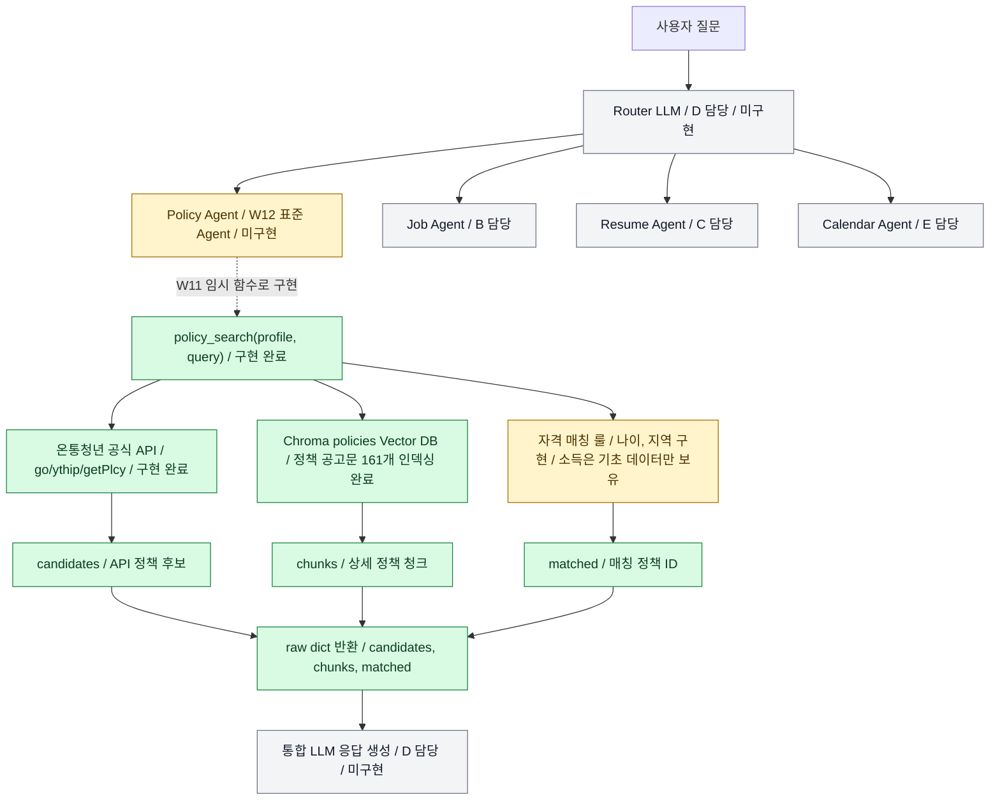
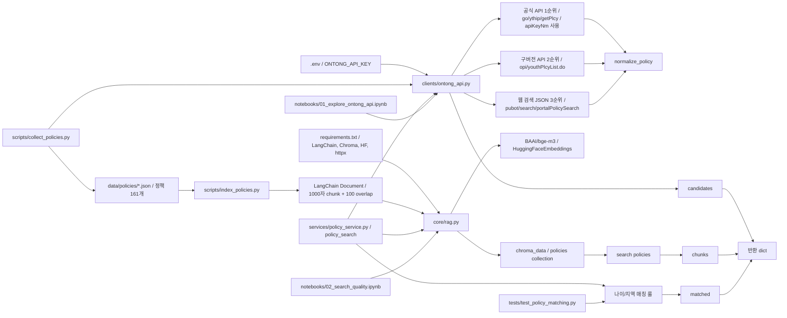
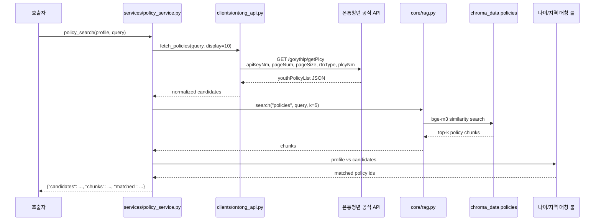
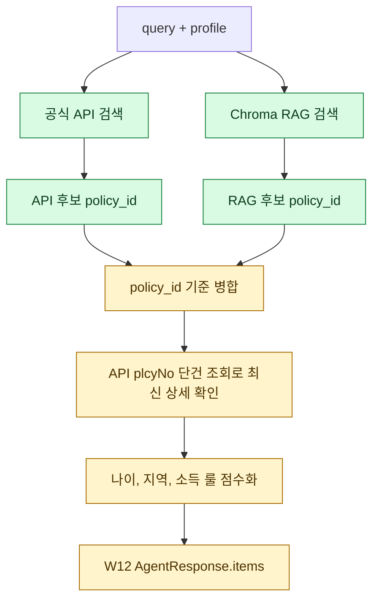

# Policy 파트 현재 구현 흐름

## 1. 전체 YouthPath 구조에서 현재 구현된 범위

## 2. 현재 작성한 코드와 장치의 연결 구조

## 3. `policy_search()` 실행 시 실제 데이터 흐름

## 4. 완료/부분완료/미완료 요약

| 영역 | 상태 | 설명 |
|---|---|---|
| 공식 API 호출 | 완료 | `go/ythip/getPlcy` + `apiKeyNm` 성공 확인 |
| 정책 데이터 수집 | 완료 | `data/policies/*.json` 161개 |
| 벡터 DB | 완료 | `chroma_data/`에 `policies` 컬렉션 인덱싱 완료 |
| RAG 검색 | 완료 | `core.rag.search()`로 상위 정책 청크 검색 |
| 단순 정책 검색 함수 | 완료 | `policy_search()`가 `candidates/chunks/matched` 반환 |
| 자격 매칭 | 부분완료 | 나이/지역 구현, 소득분위 매칭은 W12에서 정교화 필요 |
| 표준 Policy Agent | 미완료 | `BaseAgent`, `AgentResponse` 합의 후 W12에 구현 예정 |
| Router/통합 응답 | 미완료 | D 담당 영역 |

## 5. API와 RAG 결합 후보

검증 결과:

- 공식 API `go/ythip/getPlcy`는 키 기반 호출 성공.
- 공식 API는 `plcyNo` 단건 조회가 가능.
- Chroma는 `policy_id` metadata filter가 가능.
- API 정책명 검색은 표현에 민감하므로 RAG 후보를 살리는 hybrid 방식이 필요.
